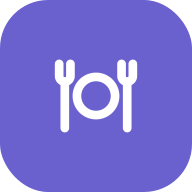
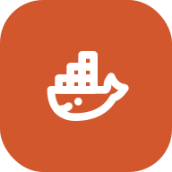
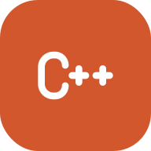
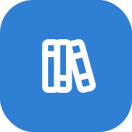
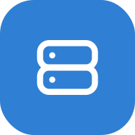
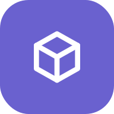
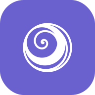
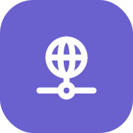

  

<h3>Software Engineer | Career Changer</h3>

Transitioning from 10+ years in healthcare to software development at Codam Coding College (42 Network)

---

## 🎓 Education & Journey

**Codam Coding College** — Amsterdam, NL  
*Started April 2025*

Making a deliberate career change from healthcare to technology. Bringing dedication, problem-solving skills, and a strong work ethic from years in nursing to the world of software development.

---

## 🛠️ Tech Stack

---

## 🚀 Current Focus

- Building proficiency in **C programming** and low-level systems
- Learning **algorithms** and **data structures**
- Developing problem-solving skills through hands-on projects
- Exploring the fundamentals of **software engineering**

---

## 📂 Featured Projects

<table>
<tr>
  <td align="center" width="150">
    <a href="https://github.com/Lucho-cadete/so_long">
       <b>so_long</b>
    </a> 2D game with MiniLibX
  </td>
  <td align="center" width="150">
    <a href="https://github.com/Lucho-cadete/Philosophers">
       <b>Philosophers</b>
    </a> Threads and mutexes
  </td>
  <td align="center" width="150">
    <a href="https://github.com/Lucho-cadete/Inception">
       <b>Inception</b>
    </a> Docker Compose infra
  </td>
  <td align="center" width="150">
    <a href="https://github.com/Lucho-cadete/CPP-modules">
       <b>CPP Modules</b>
    </a> OOP in C++98
  </td>
</tr>
</table>

<!--
  ============================================================
  MÁS PROYECTOS — descoméntalos según vayas haciendo públicos
  los repos. Los iconos ya están todos en assets/.
  OJO: cub3D y minishell son repos de danielc010 y ahora mismo
  están en privado, así que sus enlaces darían 404.
  Pega las <td> que quieras dentro de una <tr> de la tabla de
  arriba (máximo 4 por fila) o crea una fila nueva.
  ============================================================

  <td align="center" width="150">
    <a href="https://github.com/Lucho-cadete/libft">
       <b>Libft</b>
    </a> Your own libc
  </td>
  <td align="center" width="150">
    <a href="https://github.com/Lucho-cadete/ft_printf">
       <b>ft_printf</b>
    </a> Variadic arguments
  </td>
 <td align="center" width="150">
    <a href="https://github.com/Lucho-cadete/get_next_line">
       <b>get_next_line</b>
    </a> Line-by-line reading
  </td>
  <td align="center" width="150">
    <a href="https://github.com/Lucho-cadete/Born2beRoot">
       <b>Born2beRoot</b>
    </a> System administration
  </td>
  <td align="center" width="150">
    <a href="https://github.com/Lucho-cadete/push_swap">
       <b>push_swap</b>
    </a> Sorting algorithms
  </td>
  <td align="center" width="150">
    <a href="https://github.com/Lucho-cadete/pipex">
       <b>pipex</b>
    </a> Pipes and processes
  </td>
  <td align="center" width="150">
    <a href="https://github.com/danielc010/cub3D">
       <b>cub3D</b>
    </a> Raycasting engine in C
  </td>
  <td align="center" width="150">
    <a href="https://github.com/danielc010/minishell">
       <b>minishell</b>
    </a> A bash from scratch
  </td>
  <td align="center" width="150">
    <a href="https://github.com/Lucho-cadete/NetPractice">
       <b>NetPractice</b>
    </a> Networks and subnets
  </td>
  <td align="center" width="150">
    <a href="https://github.com/Lucho-cadete/cpp_modules">
       <b>CPP Modules</b>
    </a> OOP in C++98
  </td>
  <td align="center" width="150">
    <a href="https://github.com/Lucho-cadete/webserv">
       <b>webserv</b>
    </a> Your own HTTP server
  </td>
  <td align="center" width="150">
    <a href="https://github.com/Lucho-cadete/ft_transcendence">
       <b>ft_transcendence</b>
    </a> Final project
  </td>
-->

*More projects coming soon as I progress through the Codam curriculum.*

---

## 🌱 About Me

Transitioning from a decade in healthcare to software engineering. I'm passionate about learning, problem-solving, and the endless possibilities that technology offers. 

**Why tech?** After years in nursing, I'm excited to build solutions that can scale and impact people in new ways. The challenge of mastering code and creating efficient, elegant software drives me forward.

---

## 📊 GitHub Stats

---

## 🎯 Goals

- Master fundamentals of **systems programming**
- Build a strong portfolio of well-crafted projects
- Contribute to **open-source** projects
- Land my first role as a **software engineer**

---

## 📈 Contribution Activity

---

## 📫 Get in Touch

Currently focused on learning and building. Open to connecting with fellow developers and industry professionals.

*Contact details will be added soon.*

---

  <i>Career changer | Problem solver | Continuous learner</i>
  
  

  
    Project icons: <a href="https://tabler.io/icons">Tabler Icons</a> (MIT) ·
    <a href="https://game-icons.net">game-icons.net</a> (CC BY 3.0)
  

